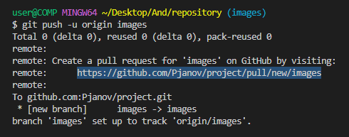

# Инструкция Pull-request

Для того чтобы сделать pull-request, необходимо загрузить необходимую ветку в удалённый репозиторий выполнив команду
 >*git push -u origin название ветки* 

И если внимательно посмотреть на тот вывод который нам показался в терминале, можно увидеть, что пришло сообщение от гитхаба с указанием ссылки по которой нужно перейти.

Или же переходим в сам проект на *GitHub* и увидем напротив уведомления, создана новая ветка, есть специальная кнопка 
>*Compare & pull request*, 

нажмём на неё и у нас автоматически открывается новый *pull-request* или запрос на слияние.

 Здесь можно указать реквесту название, написать некий комментарий для тех кто будет его смотреть. Также здесь указано из какой ветки в какую будет производиться *merge*, а также снизу вкратце описано что произошло с каждым из файлов. Нажав на кнопку 
 >*Create pull request* 
 
 создаётся новый объект репозитория который доступен только на сервисе *GitHub*.

Любой человек участвующий в разработке этого программного обеспечения может зайти в раздел 
>*pull request*, 

увидеть что есть открытый *pull request* под нужным названием, зайти в него и посмотреть какие коммиты были сделаны, какие файлы были изменены и посмотреть что конкретно в них изменилось.

Если его что-то не устраивает он может оставить комментарий зайди во вкладку 
>*Conversation* затем *write*, написать комментарий и нажать кнопку *Comment*